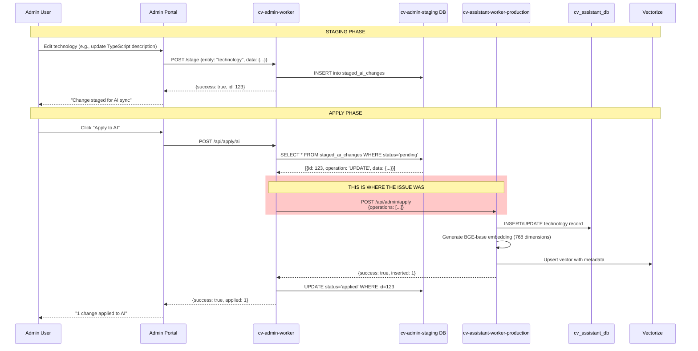
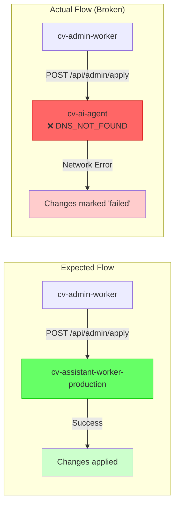
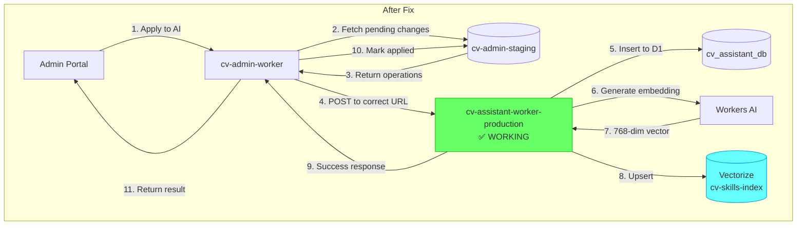

# AI Sync Flow - Troubleshooting Guide

## Problem Statement

The Admin Portal's "Apply to AI" functionality was failing to sync technology data to the AI Agent's semantic search index. Changes staged in the Admin Portal were not being reflected in the chatbot's knowledge base.

---

## System Architecture Overview

```mermaid
graph TB
    subgraph "Frontend Layer"
        PORTAL[Admin Portal<br/>admin.{YOUR_DOMAIN}]
    end

    subgraph "Orchestration Layer"
        WORKER[cv-admin-worker<br/>cv-admin.{YOUR_WORKERS_SUBDOMAIN}]
        STAGING[(cv-admin-staging<br/>D1 Database)]
    end

    subgraph "AI Layer"
        AI[cv-assistant-worker-production<br/>cv-assistant-worker-production.{YOUR_WORKERS_SUBDOMAIN}]
        AIDB[(cv_assistant_db<br/>D1 Database)]
        VECTORIZE[(Vectorize Index<br/>cv-skills-index)]
    end

    PORTAL -->|1. Stage changes| WORKER
    WORKER -->|2. Store| STAGING
    PORTAL -->|3. Apply to AI| WORKER
    WORKER -->|4. POST /api/admin/apply| AI
    AI -->|5. Insert/Update| AIDB
    AI -->|6. Generate embeddings| VECTORIZE

    style WORKER fill:#ff9999,stroke:#cc0000
    style AI fill:#99ff99,stroke:#00cc00
```

---

## The Sync Flow in Detail

### Step-by-Step Process



---

## The Issue

### Root Cause

The `AI_AGENT_API_URL` secret in cv-admin-worker was configured with an **incorrect URL**:

| Configuration | Value | Status |
|--------------|-------|--------|
| **Configured URL** | `https://cv-ai-agent.{YOUR_WORKERS_SUBDOMAIN}` | ❌ Does not exist |
| **Correct URL** | `https://cv-assistant-worker-production.{YOUR_WORKERS_SUBDOMAIN}` | ✅ Working |

### What Was Happening



### Symptoms

1. **In Admin Portal**: "Apply to AI" button would fail or timeout
2. **In Staging DB**: Changes stuck in `pending` or marked as `failed`
3. **In Chatbot**: New or updated skills not appearing in search results
4. **In Logs**: Network errors like `ENOTFOUND` or `DNS resolution failed`

---

## The Fix

### What Was Done

1. **Updated the secret** in cv-admin-worker:
   ```bash
   npx wrangler secret put AI_AGENT_API_URL
   # Entered: https://cv-assistant-worker-production.{YOUR_WORKERS_SUBDOMAIN}
   ```

2. **Updated documentation** in `SECRETS.md` with correct URLs

3. **Created architecture documentation** to prevent future confusion

### Expected Outcome After Fix



---

## Verification Checklist

### Pre-Verification (Already Confirmed ✅)

| Check | Status | Details |
|-------|--------|---------|
| AI Agent health | ✅ | `/health` returns `{status: "healthy", db: "connected"}` |
| Database connectivity | ✅ | cv_assistant_db connected |
| AI quota available | ✅ | 9490/9500 neurons remaining |
| Secret updated | ✅ | `wrangler secret put` succeeded |

### End-to-End Verification (Pending)

| Step | How to Verify |
|------|---------------|
| 1. Stage a change | Open Admin Portal → Edit a technology → Save |
| 2. Check staging | Portal should show 1 pending AI change |
| 3. Apply to AI | Click "Apply to AI" button |
| 4. Verify success | Should show "1 change applied" |
| 5. Test search | Query chatbot for the updated technology |
| 6. Confirm in Vectorize | `/api/debug/vectors` should show updated timestamp |

---

## Related Files

| File | Purpose |
|------|---------|
| `cv-admin-worker/src/index.ts` | Contains `applyAiHandler` that calls AI Agent |
| `cv-admin-worker/SECRETS.md` | Documents all required secrets |
| `cv-admin-worker/docs/ARCHITECTURE.md` | Full system architecture diagrams |
| `cv-ai-agent/src/index.ts` | AI Agent's `/api/admin/apply` handler |

---

## Naming Confusion (Historical Context)

The project has two similar worker names which caused confusion:

| Worker Name | Purpose | Status |
|-------------|---------|--------|
| `cv-assistant-worker` | Was the dev environment | ❌ Deleted (redundant) |
| `cv-ai-agent` | Conceptual name used in documentation | ⚠️ No worker with this exact name exists |
| `cv-assistant-worker-production` | The actual AI Agent (semantic search) | ✅ Active, correct URL |

**Recommendation**: Consolidate to single worker name to avoid future confusion.
