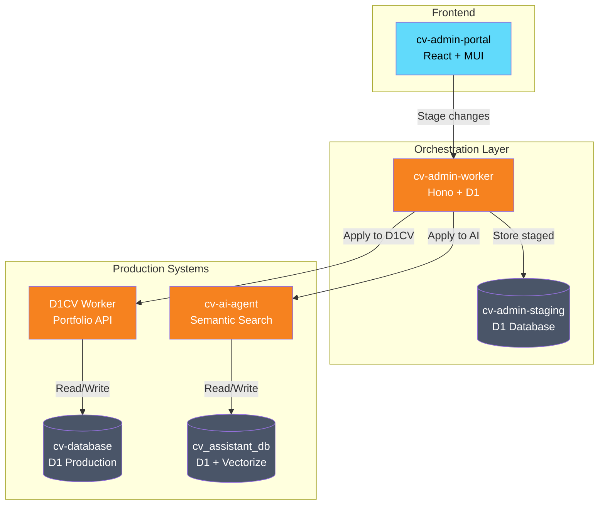
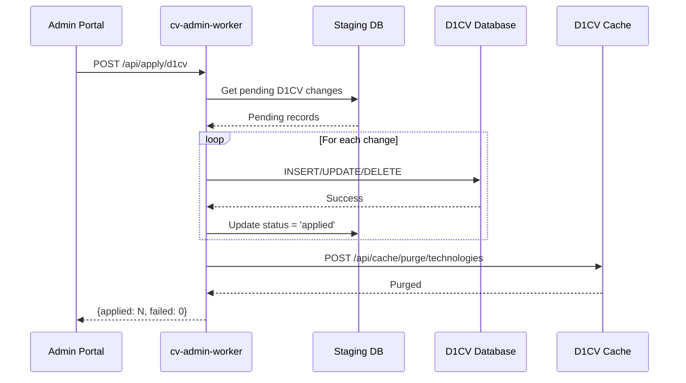
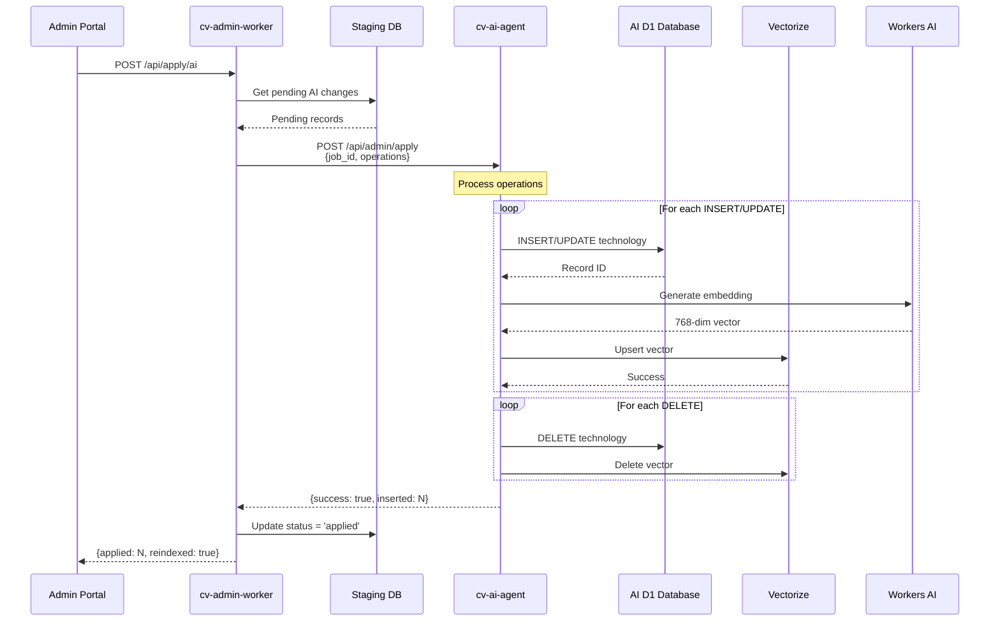
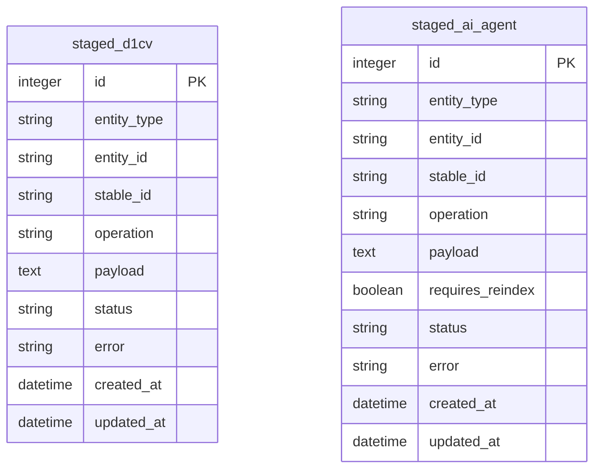
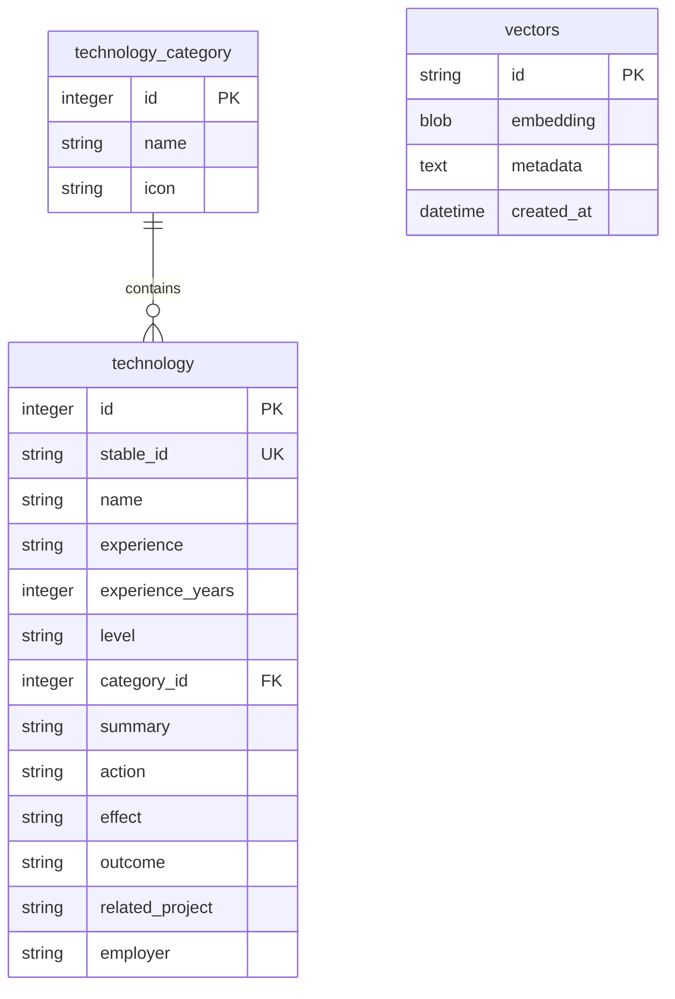

# CV Admin System - Architecture Documentation

> **Last Updated:** 2025-12-01  
> **Status:** Production  
> **Author:** Jose Alvarez

---

## Overview

The CV Admin System is a multi-service architecture for managing portfolio content with AI-powered semantic search. It consists of three main components that work together to stage, apply, and index technology skills data.

---

## System Architecture



---

## Component Responsibilities

### 1. cv-admin-portal (Frontend)

**Repository:** `cv-admin-portal-private`  
**URL:** `https://admin.{YOUR_DOMAIN}`  
**Stack:** React 18, TypeScript, Material UI, TanStack Query

| Responsibility | Description |
|----------------|-------------|
| UI for content management | CRUD operations for technologies, experience, etc. |
| Staging workflow | Stage changes before applying to production |
| Dual-queue management | Separate queues for D1CV and AI Agent |
| Apply triggers | Buttons to apply staged changes to target systems |

### 2. cv-admin-worker (Orchestrator)

**Repository:** `cv-admin-worker-private`  
**URL:** `https://api.admin.{YOUR_DOMAIN}`  
**Stack:** Hono, TypeScript, Cloudflare Workers, D1

| Responsibility | Description |
|----------------|-------------|
| Staging database | Stores pending changes in `cv-admin-staging` D1 |
| D1CV proxy | Proxies read requests to D1CV for unified auth |
| Apply to D1CV | Direct D1 writes to `cv-database` |
| Apply to AI Agent | Calls `/api/admin/apply` on cv-ai-agent |
| Cache purging | Invalidates D1CV cache after mutations |

### 3. cv-ai-agent (Semantic Search Engine)

**Repository:** `cv-ai-agent-private`  
**URL:** `https://cv-assistant-worker-production.{YOUR_WORKERS_SUBDOMAIN}`  
**Stack:** TypeScript, Cloudflare Workers, D1, Vectorize, Workers AI

| Responsibility | Description |
|----------------|-------------|
| D1 data storage | Stores technology records in `cv_assistant_db` |
| Embedding generation | Creates 768-dim vectors via Workers AI (BGE-base) |
| Vector indexing | Upserts embeddings to Vectorize index |
| Semantic search | Handles `/query` endpoint for chatbot |
| Admin apply endpoint | `/api/admin/apply` for batch operations |

---

## Data Flow: Staging to Production

### Flow 1: Apply to D1CV (Portfolio)



### Flow 2: Apply to AI Agent (Semantic Search)



---

## Database Schema

### cv-admin-staging (Staging Database)



### cv_assistant_db (AI Agent Database)



---

## API Endpoints

### cv-admin-worker

| Method | Endpoint | Description |
|--------|----------|-------------|
| GET | `/api/technologies` | List all technologies (proxy to D1CV) |
| GET | `/api/technologies/with-ai-match` | Technologies with AI sync status |
| POST | `/stage` | Stage a new change |
| GET | `/staged` | Get all staged changes |
| POST | `/api/apply/d1cv` | Apply D1CV changes |
| POST | `/api/apply/ai` | Apply AI Agent changes |
| POST | `/api/purge-d1cv-cache` | Purge D1CV cache |

### cv-ai-agent

| Method | Endpoint | Description |
|--------|----------|-------------|
| GET | `/health` | Health check with quota info |
| POST | `/query` | Semantic search query |
| POST | `/api/admin/apply` | Batch apply operations |
| POST | `/index` | Trigger vector indexing |
| GET | `/api/admin/quota` | AI quota status |

---

## Secrets Configuration

### cv-admin-worker Secrets

```powershell
cd D:\Code\cv-admin-worker-private

# D1CV API for portfolio data
npx wrangler secret put D1CV_API_URL
# Value: https://api.d1.worker.{YOUR_DOMAIN}

# AI Agent API for semantic search (CORRECTED 2025-12-01)
npx wrangler secret put AI_AGENT_API_URL
# Value: https://cv-assistant-worker-production.{YOUR_WORKERS_SUBDOMAIN}

# Authorised admin emails
npx wrangler secret put ALLOWED_EMAILS
# Value: {YOUR_EMAIL}

# Webhook HMAC secret
npx wrangler secret put WEBHOOK_SECRET
# Value: (generate with command below)
```

### Generate Webhook Secret

```powershell
[System.Convert]::ToBase64String(
  [System.Security.Cryptography.RandomNumberGenerator]::GetBytes(32)
)
```

---

## Manual Operations (cv-skills-ops)

The `cv-skills-ops` folder in `cv-ai-agent-private` contains scripts for manual maintenance:

| Script | Purpose | When to Use |
|--------|---------|-------------|
| `reindex.ps1` | Full vector re-indexing | After bulk data changes |
| `add-technology.ps1` | Add single technology | Quick manual adds |
| `verify-sync.ps1` | Check D1/Vectorize sync | Debugging mismatches |

### Re-index All Vectors

```powershell
cd D:\Code\cv-ai-agent-private\cv-skills-ops
.\reindex.ps1 -Environment production
```

---

## Troubleshooting

### AI Sync Failing

1. **Check AI_AGENT_API_URL secret is correct:**
   ```powershell
   # Correct URL (as of 2025-12-01):
   # https://cv-assistant-worker-production.{YOUR_WORKERS_SUBDOMAIN}
   ```

2. **Verify AI Agent is healthy:**
   ```powershell
   Invoke-RestMethod -Uri "https://cv-assistant-worker-production.{YOUR_WORKERS_SUBDOMAIN}/health"
   ```

3. **Check AI quota:**
   ```powershell
   Invoke-RestMethod -Uri "https://cv-assistant-worker-production.{YOUR_WORKERS_SUBDOMAIN}/api/admin/quota"
   ```

### D1CV Apply Failing

1. **Check D1CV_DB binding in wrangler.toml**
2. **Verify category_id exists in target database**
3. **Check for constraint violations (unique names)**

---

## Version History

| Date | Change | Author |
|------|--------|--------|
| 2025-12-01 | Fixed AI_AGENT_API_URL secret (was pointing to non-existent URL) | Jose |
| 2025-11-29 | Added webhook flow documentation | Jose |
| 2025-11-15 | Initial architecture documentation | Jose |

---

## Related Documentation

- [SECRETS.md](./SECRETS.md) - Secret values reference
- [README.md](./README.md) - Quick start guide
- [cv-ai-agent-private/cv-skills-ops/README.md](../cv-ai-agent-private/cv-skills-ops/README.md) - Manual ops guide
